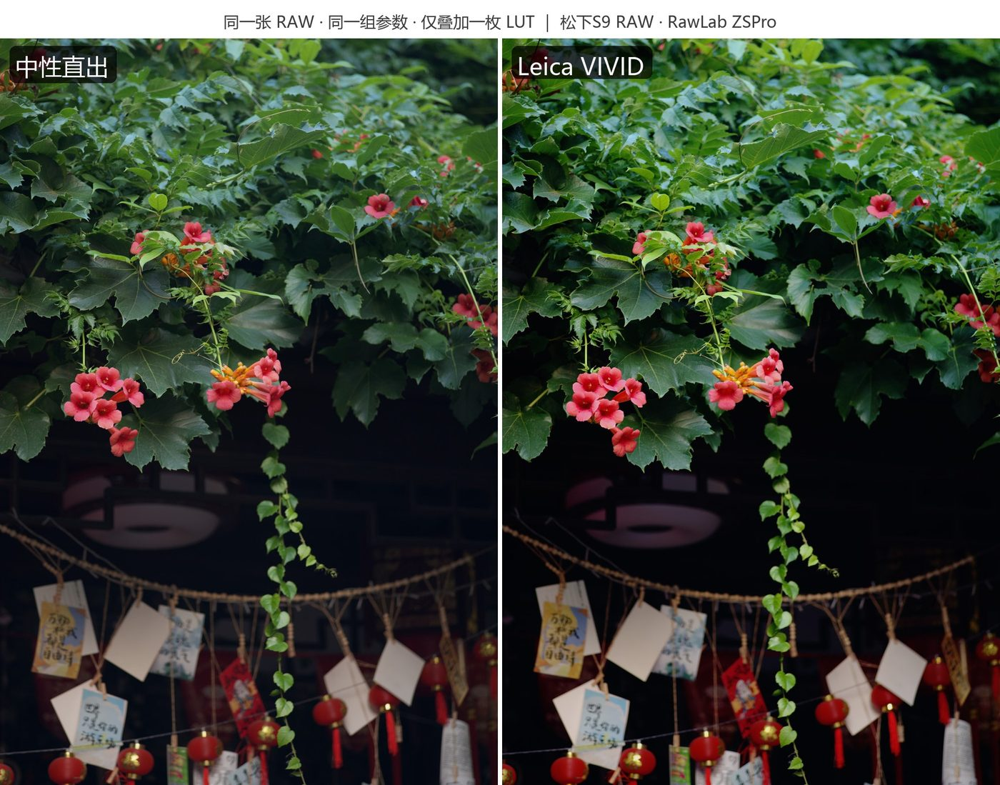
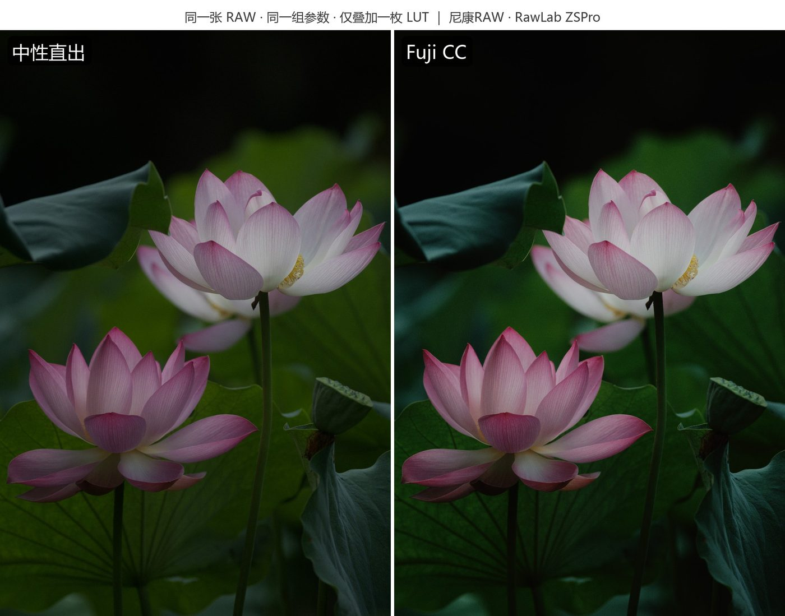
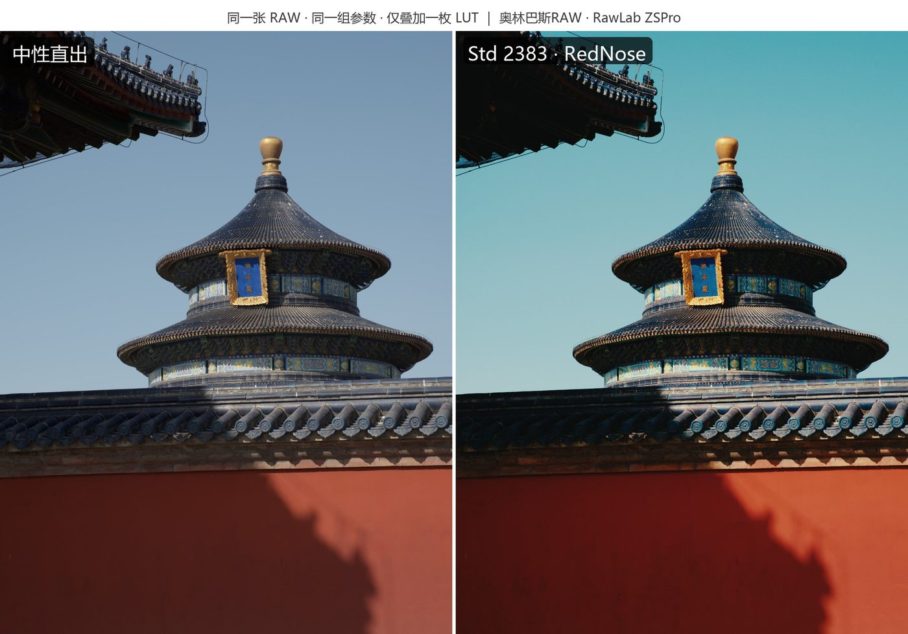
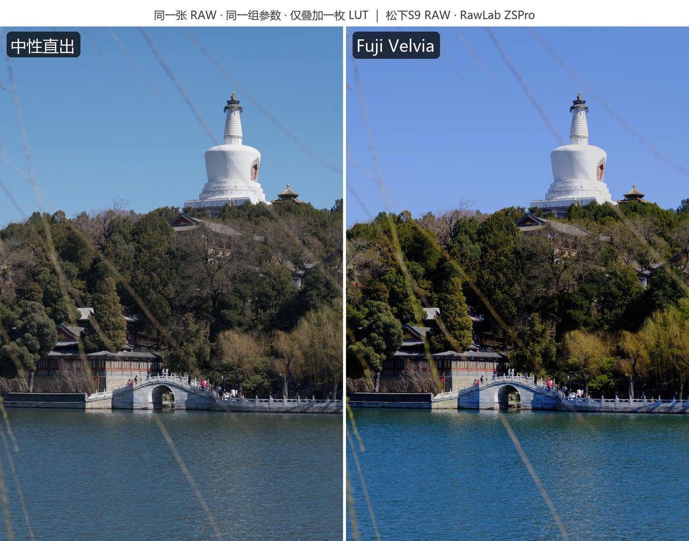

# RawLab ZSPro

[简体中文](README.md) | **English**

A cross-brand RAW development and film-style LUT workstation. RawLab ZSPro is an enhanced distribution built on the open-source **RawLab** project (MIT), sharing a C++ processing core, command-line tools and native Windows / Mac / Android editors.

**Original upstream project: https://github.com/dancancer/RawLab** — this repository is an enhanced distribution fork; the original MIT license and copyright notices are fully preserved, see [LICENSE](LICENSE).

## What ZSPro adds on top of upstream (current version v1.6.8)

The enhancements below focus on the Android client and the shared core:

### LUT library
- **Three input encodings**: display-encoded (generic look LUTs), F-Log2 input (Fujifilm official technical conversions), and auto-detection via `#Gamma` comments on import.
- **Batch import + base selection**: import multiple `.cube` files at once with automatic / neutral / Panasonic STD base; each LUT gets a reference-scene thumbnail.
- **Panasonic STD base adaptation**: based on official STD→V-Log mapping data extracted from LUMIX LAB, adapting through a layered chain of "neutral → scene-linear → STD display curve (official gray-axis inversion, 1D gray preserved) → look LUT". Strong looks adapt without color banding or interpolation noise.
- **Dual LUT combiner**: a dedicated full-screen UI with A/B slots, individual strengths and live preview; bake the stack into a new LUT.
- **Manual base switching**: long-press a LUT to switch between the neutral and Panasonic STD base; the look re-adapts on switch.
- **Tetrahedral interpolation**: replaces trilinear sampling across all four render paths (CPU / GLES / Direct3D 11 / Metal) — 4 samples instead of 8, no hue drift in saturated regions, and lattice points match the source data bit-exactly.

### Development and fixes
- **LibRaw 0.22.0**: unlocks RAW decoding for new cameras such as the Panasonic DC-S9 (on 0.21.x the S9 RW2 stream is mis-decoded into white-background magenta noise); camera white balance and color-matrix metadata are fully preserved.
- **Temperature WB compatibility fix**: models missing from LibRaw's camera matrix table (e.g. the OM-5) fall back to the sRGB matrix anchored at 6500 K so the temperature slider keeps working; models with full matrices keep the precise path.
- **Ten adjustment sliders**: exposure, contrast, saturation, tone curve, sharpening, highlights, shadows, temperature, tint and film strength — CPU/GPU consistent end to end.
- **Zoom inspection**: two-finger 1–8× centroid-anchored zoom for detail checking.
- **Exhaustive verification**: full 256-step R/G/B/gray ramp checks, full-lattice sweeps, lattice identity, and saturation ladders (`host-harness/ramp_check.cpp`, `sat_check.cpp`).

## Real-world comparisons

Same RAW file, same set of parameters, with a single LUT applied on top. Left: neutral render; right: film look. The three STD-based looks all went through the Panasonic STD base adaptation.

| Trumpet vine · Panasonic S9 · Leica VIVID | Lotus · Nikon · Fuji CC |
|---|---|
|  |  |
| **Temple of Heaven · Olympus · Kodak 2383 (Std)** | **Beihai White Dagoba · Panasonic S9 · Fuji Velvia** |
|  |  |

The three samples come from Panasonic, Nikon and Olympus bodies respectively, verifying cross-brand decoding consistency. The sample LUTs are third-party community works (Leica/Fujifilm official styles, Kodak 2383 by RedNose, etc.), shown for demonstration only and not distributed with the app.

## Preview


RawLab Mac provides side-by-side neutral/film comparison, LUT selection, exposure and white-balance adjustments, and full-resolution export. The screenshot shows the neutral render on the left and the Velvia look on the right.

## Download

### RawLab ZSPro Android

**v1.6.8**: see [docs/releases/android-v1.6.8.md](docs/releases/android-v1.6.8.md). Requires Android 8.0+; a universal APK for ARM64 / x86_64, with automatic CPU fallback when GLES is unavailable.

### Upstream RawLab

[Download RawLab Windows v0.1.0](https://github.com/dancancer/RawLab/releases/tag/windows-v0.1.0)

Requires Windows 10/11 x64. Extract the ZIP and run `RawLab.exe`. The package includes the .NET runtime and supports Direct3D 11 acceleration with CPU fallback.

[Download RawLab Mac v0.1](https://github.com/dancancer/RawLab/releases/tag/v0.1)

Requires Apple Silicon (arm64) and macOS 26 or later. The app is ad-hoc signed and has not been notarized by Apple.

[Download RawLab Android v0.1.0](https://github.com/dancancer/RawLab/releases/tag/android-v0.1.0)

Requires Android 8.0+. The signed APK includes ARM64 / x86_64.

## Build

```bash
# Android (offline build; the LibRaw source tree can be downloaded from www.libraw.org)
cd RawLabAndroid
RAWLAB_LIBRAW_SOURCE=/path/to/LibRaw-0.22.0 ./gradlew assembleDebug
```

Requires the Android SDK (pointed to by `local.properties`), the NDK and CMake 3.22+. Build recipes and verification notes live in `RawLabAndroid/README.md`; host-side test tools (including the ramp/sat checkers) live in `host-harness/` (an out-of-repo directory distributed with the workspace).

## Branching

- `main`: the upstream baseline (original RawLab history preserved for comparison and upstream contributions).
- `zspro`: the ZSPro development branch — all enhancements and branding commits land here; once stable they are merged back to `main` and released with `zspro-v*` tags.
- Generic fixes (build fixes, WB compatibility, etc.) are collected on the `pr/build-fixes` branch, suitable for upstream PRs.

## Documentation

- [Enhancement lessons](docs/lessons-lut-feature.md)
- [Panasonic pipeline research](docs/research/05-panasonic-lumix-lab-pipeline.md)
- [Windows editor](RawLabWindows/README.md)
- [Android editor](RawLabAndroid/README.md)
- [Mac editor](RawLabMac/README.md)
- [Processing core and CLI](lutools/README.md)
- [RAW, color-space and LUT contract](lutools/docs/color-contract.md)

## License and attribution

- Original code is licensed under the upstream [MIT License](LICENSE) (Copyright (c) 2026 RawLab contributors); ZSPro modifications are likewise MIT.
- The in-app "Licenses" screen lists complete third-party notices: LibRaw 0.22.0 (dual-licensed LGPL-2.1 / CDDL; official sources and SHA-256 listed in-app), zlib 1.3.1, the stb image libraries, and the **personal-use boundary** of the bundled Panasonic STD→V-Log functional data.
- Third-party LUTs and data bundled with the app do not change their own licenses; LUTs imported by users are not distributed with the app. Trademarks and brand names (Panasonic LUMIX, FUJIFILM, etc.) belong to their respective owners; this app is not affiliated with those manufacturers.

## IP notice

- The color math implemented by this project's original code (temperature fitting, transfer functions, LUT adaptation, etc.) derives from **public literature, public specifications and properly licensed third-party libraries** (LibRaw, the Adobe DNG SDK — its license text is distributed with the repo at [lutools/third_party/Adobe-DNG-SDK-LICENSE.txt](lutools/third_party/Adobe-DNG-SDK-LICENSE.txt)); it contains no proprietary code or firmware data from any manufacturer.
- The MIT license is provided as-is and **grants no express patent license**; third-party libraries carry their own patent arrangements (the CDDL portion of LibRaw includes patent-grant terms). Evaluate the patent situation in your jurisdiction before commercial distribution.
- This app is an independent project, **not authorized or endorsed by Panasonic, Fujifilm, Nikon, Olympus, Adobe or any other manufacturer**; camera models and brands are mentioned only to describe compatibility (nominative fair use). The bundled Panasonic STD→V-Log mapping data is for personal interoperability use only and must not be redistributed separately.
